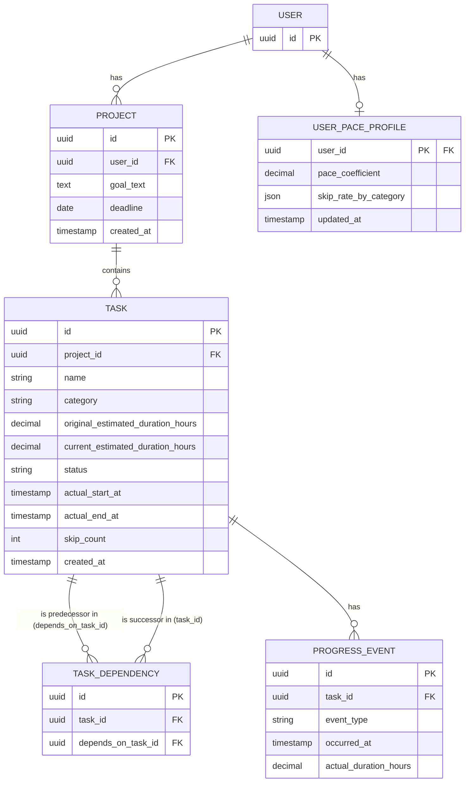

# データベース設計

出典: `docs/requirements/cpm-dynamic-replanning.md`

## 概念モデル

**エンティティと主要属性**
- **ユーザー**: 識別子（審査員が個別に試せるよう、プロジェクトをユーザー単位で分離するために必要）
- **プロジェクト**: ゴール、締切
- **タスク**: タスク名、見積もり時間、状態（未着手/進行中/完了/スキップ）、カテゴリ
- **進捗イベント**: 種別（完了/スキップ）、発生日時

**関連（カーディナリティ）**
- ユーザー は 複数の プロジェクト を持つ（1:N）
- プロジェクト は 複数の タスク から構成される（1:N）
- タスク は 他の タスク に先行する（M:N、自己関連＝依存関係）
- タスク は 複数の 進捗イベント を持つ（1:N）

## 論理モデル：決定事項

- タスク間の依存関係（M:N自己関連）は`TaskDependency`中間テーブルで解決する
- タスクの見積もり時間は「AIの初期見積もり（`original_estimated_duration_hours`、不変）」と「学習係数反映後の現在値（`current_estimated_duration_hours`）」に分離して保持する
- ユーザーの完了ペース係数・カテゴリ別スキップ率は`UserPaceProfile`にキャッシュし、進捗イベント記録のたびに再計算してupsertする（デモ用シードデータもこのテーブルへ直接値を入れるだけで済む。[[demo-seed-strategy]] 参照）
- CPM計算結果（ES/EF/LS/LF/スラック/クリティカルパス判定）は永続化せず、ダッシュボード表示のたびにバックエンドで再計算する（[[cpm-algorithm]] 参照）

## ER図

