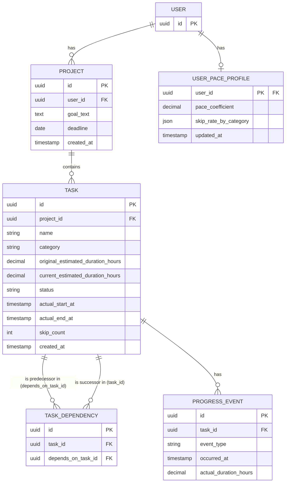

# 要件定義：進捗に応じた動的再計画（CPM：クリティカルパス分析）

## 背景・目的

本ハッカソン（HACKATHON 2026 SUMMER）のテーマは「Human Time Hack」。単に作業時間を減らすのではなく、**AIに"意思決定を伴わない機械的な作業（Mechanical Time）"を肩代わりさせ、人が本来向き合うべき時間（Human Time）を増やす**ことが評価軸の核（40点）になる。

本機能はテーマ③「次に何をすべきかの整理をなくせ」に対応する。個人が中長期プロジェクト（例：ハッカソン開発、資格勉強、個人開発）を進める際、以下のような"計画の立て直し"作業は本来やりたいことではないのに人の時間を奪っている：

- 遅れが出るたびに、後続タスクの期日をすべて手で計算し直す
- 「今、本当に急ぐべきタスクはどれか（クリティカルパス）」を都度頭の中で洗い出す
- スキップ・先延ばしが続いても計画表だけは当初のまま残り、結局見なくなる

この機能は「計画は遅れるのが前提」という立場に立ち、ユーザーの実際の作業ペース・スキップ傾向をAIが学習し、クリティカルパス分析（CPM）でボトルネックを特定した上で、ロードマップ全体をリアルタイムに自動修正する。ユーザーは常に「修正済みの、今日やるべきこと」だけを見ればよい状態を目指す。

本ドキュメントは**技術設計ではなく要件定義**として、2日間のハッカソンで実装可能なMVP範囲に絞って定義する。技術スタック選定・詳細画面設計は本要件定義の後続作業とする。

## 前提

- 対象：**個人**の中長期プロジェクト計画（チーム利用は対象外）
- タスク・依存関係・所要時間見積もりは、**AIがゴール（自然言語の目標）から自動でタスク分解し、依存関係グラフを生成する**（ユーザーの手入力は最小限）
- 「スキップ」＝ユーザーが明示的に「後回し/スキップ」を押した操作ログ。AIの学習対象は主に **①タスク完了ペース（見積もり時間 vs 実績時間の比率）** と **②スキップの発生傾向**
- スコープはMVP：審査基準（Human Time増加／使いたいか／独自性）を満たす最小構成に絞る

## 機能要件（MVP）

### 1. ゴール入力 → AIタスク分解
- ユーザーが自然言語でゴールと締切（任意）を入力
- AIがゴールをタスクリストに分解し、各タスクに以下を付与：
  - タスク名、見積もり所要時間、先行タスク（依存関係）
- 生成結果をユーザーが軽く確認・編集できる（全否定はしない、微調整のみ許容）

### 2. CPMエンジン（クリティカルパス計算）
- タスク依存グラフに対しフォワードパス（ES/EF：最早開始・終了）とバックワードパス（LS/LF：最遅開始・終了）を計算
- 各タスクのスラック（余裕時間 = LS − ES）を算出し、スラック＝0のタスク列を「クリティカルパス」として特定
- 全体の完了予定日（プロジェクト所要期間）を算出

### 3. 進捗記録
- タスクごとに「完了」「スキップ（後回し）」を記録できる操作（ワンタップ想定）
- 完了時：実績所要時間（開始〜完了）を記録
- スキップ時：スキップ回数・直近スキップ日を記録

### 4. 動的再計算（AIロジック）
再計算のトリガー：タスクの完了・スキップが記録されるたび、または一定時間経過時。

学習ロジック（MVPではシンプルな統計で十分、複雑なMLモデルは不要）：
- **完了ペース係数**：直近タスクの「実績時間／見積もり時間」の移動平均を算出し、未完了タスクの残り見積もりに反映（例：ユーザーが平均1.3倍の時間がかかる傾向なら、残タスクの見積もりを1.3倍に補正）
- **スキップ傾向**：特定タスク（または類似タスク）が繰り返しスキップされている場合、そのタスクにバッファを追加、または優先度を下げて後続への影響を再評価

再計算後、CPMエンジン（機能2）を「現在日時・実績・補正後見積もり」を起点に再実行し、新しいクリティカルパスと各タスクの期日を出す。ユーザーが手でスケジュールを引き直す操作は発生しない。

### 5.「今日やるべきこと」ダッシュボード（メイン画面）
- 再計算後の状態から、今日着手すべきタスク（クリティカルパス上のタスク優先）のみを表示
- 過去の全計画やガントチャートの詳細はメイン導線に出さず、必要な人だけが見る補助画面に格納
- クリティカルパス上のタスクである場合、その旨を視覚的に強調（遅延がプロジェクト全体に直結することを示す）

## 非機能要件（MVP）

- タスク数が数十件程度（個人プロジェクト規模）でCPM再計算が体感遅延なく動くこと
- タスク分解・CPM計算のロジックはUIから独立させ、後から学習ロジックを差し替え可能な構成にする（ただしMVPでは過剰な抽象化はしない）

## データベース設計：概念モデル

エンティティと主要属性、関連（カーディナリティ）のみを定義する。フィールドの型やキー設計、中間テーブルなど実装寄りの詳細は論理モデルで扱う。

**エンティティと主要属性**
- **ユーザー**：識別子（審査員が個別に試せるよう、プロジェクトをユーザー単位で分離するために必要）
- **プロジェクト**：ゴール、締切
- **タスク**：タスク名、見積もり時間、状態（未着手/進行中/完了/スキップ）、カテゴリ
- **進捗イベント**：種別（完了/スキップ）、発生日時

**関連（カーディナリティ）**
- ユーザー は 複数の プロジェクト を持つ（1:N）
- プロジェクト は 複数の タスク から構成される（1:N）
- タスク は 他の タスク に先行する（M:N、自己関連＝依存関係）
- タスク は 複数の 進捗イベント を持つ（1:N）

## データベース設計：論理モデル

概念モデルを実装可能な形に落とし込んだもの。決定事項は以下の通り：

- タスク間の依存関係（M:N自己関連）は`TaskDependency`中間テーブルで解決する
- タスクの見積もり時間は「AIの初期見積もり（`original_estimated_duration_hours`、不変）」と「学習係数反映後の現在値（`current_estimated_duration_hours`）」に分離して保持する
- ユーザーの完了ペース係数・カテゴリ別スキップ率は`UserPaceProfile`にキャッシュし、進捗イベント記録のたびに再計算してupsertする（デモ用シードデータもこのテーブルへ直接値を入れるだけで済む）
- CPM計算結果（ES/EF/LS/LF/スラック/クリティカルパス判定）は永続化せず、ダッシュボード表示のたびにバックエンドで再計算する



## AIタスク分解プロンプト設計

### 方針
依存関係は目標の実態に忠実に生成させる。CPMの見栄え（並行タスクの有無）のためにAIへ不自然な誘導はしない。そのぶん、地味なグラフになるリスクは「デモ設計：シードデータ戦略」で使うゴール例の選定（自然に並行タスクが生まれるゴールを選ぶ）でカバーする。

### System prompt（案）
```
あなたはプロジェクトマネジメントの専門家です。
ユーザーが入力した目標を、クリティカルパス分析（CPM）に使えるタスク依存グラフに分解してください。

制約:
- タスク数は5〜15個程度にする
- 各タスクの見積もり時間は現実的な範囲にする（極端に短い/長い値を避ける）
- 依存関係は目標の実態に忠実に設計する。無理に直列や並列の構造を作らない
- 循環依存（AがBに依存し、BがAに依存する等）を作らない
- 出力は指定のJSON schemaに厳密に従い、説明文やコードブロックの前置きは付けない
```

### User prompt
ゴール文 + 締切（あれば）+ 時間粒度のヒント（例：「2日間で終わらせたい」→時間単位、「3ヶ月後の試験まで」→日単位。締切の長さから自動判定するか、ユーザーに聞くかは技術設計で決定）

### 出力スキーマ（Structured Output / tool useで強制）
`tasks[].{id, name, estimated_duration_hours, depends_on[]}` の形式で強制し、自由テキストの混入を防ぐ

### 後処理（決定的な検証。プロンプトだけに頼らない）
- **循環依存検知**：トポロジカルソートで検出し、検出時はエラー内容をAIにフィードバックして再生成
- **見積もり時間のクランプ**：上下限を設け、非現実的な値を補正
- **並行度チェック**：全タスクが直列一本道になっていないかを検知するが、再生成のトリガーにはせず、ログ/警告に留める（自然な分解を優先する方針のため）

## UI構成（画面一覧）

MVPは以下の4画面に絞る。

1. **ゴール入力画面**（初回のみ）：目標＋締切を自然文で入力し、送信するとAIタスク分解が走る
2. **タスク確認・編集画面**：AIが生成したタスク＋依存関係を一覧表示し、軽く手直し（削除・時間の微調整程度）してから確定する
3. **「今日やるべきこと」ダッシュボード**（メイン画面）：今日着手すべきタスクをカード形式で数枚だけ表示。各カードに「クリティカルパス上か」のバッジ、残り見積もり時間、完了/スキップのワンタップボタンを置く
4. **補助画面（全体ビュー）**：プロジェクト全体の進捗を見たい人向け。実装コストを抑えるため、インタラクティブな依存関係グラフ／ガントチャートは作らず、以下のシンプルな構成にする：
   - タスクを開始日順のフラット一覧で表示
   - クリティカルパス上のタスクを色（左ボーダー／バッジ）で強調
   - 各タスクの余裕時間（スラック）をテキストで併記（例：「余裕: 2日」「スラックなし」）
   - 任意で、見積もり時間に比例した幅のCSSバーを添えて簡易ガント風の時間感を出す

補助画面をシンプルに留める分、審査員への見せ場は「メインダッシュボードのライブ再計算実演」と「デモ用ゴール例で自然に生まれる並行タスク構造」に寄せる（デモ設計：シードデータ戦略、AIタスク分解プロンプト設計を参照）。

## 技術スタック

デモは審査員自身がリンクから試せる形にする（発表者のローカル実行のみにはしない）ため、以下の構成とする。

- **フロントエンド**：React + Vite（軽量SPA）。デプロイ先はVercel
- **バックエンド**：FastAPI（Python）。CPM計算ロジック、進捗記録API、AIタスク分解の呼び出しを担当。デプロイ先はRenderまたはRailway
  - 補足：VercelはNext.js等のフロント／サーバーレス向けで常時稼働のPythonバックエンドとは相性が悪いため、フロントとバックエンドのデプロイ先を分ける
- **データベース**：Supabase（Postgres）。Task/Project/ProgressEventは依存関係を持つ関係データのため、NoSQLのFirestoreよりPostgresの方が素直に表現できる。FastAPIから`supabase-py`で接続
- **AI**：Claude API。「AIタスク分解プロンプト設計」で定義したtool use（Structured Output）で構造化JSONを取得。呼び出しは`anthropic`公式Python SDKを使用
- **UIライブラリ/スタイリング**：Tailwind CSS + shadcn/ui
- **フロントの状態管理**：TanStack Query（React Query）。orvalが生成するフックと組み合わせ、進捗記録後の`/projects/{id}/schedule`再取得をキャッシュ無効化で実装する
- **バックエンドの設定管理**：`pydantic-settings`でAPIキー等の環境変数を管理
- **DBマイグレーション**：Supabase CLIでスキーマ変更を管理する
- **テスト方針**：CPM計算ロジック（`compute_schedule`）を中心に`pytest`で最低限のユニットテストを用意する
- **リポジトリ構成**：モノレポ（1リポジトリ内に`/frontend`と`/backend`を配置）。Vercel（frontend）・Render/Railway（backend）それぞれのデプロイ設定でルートディレクトリを個別指定する。Turborepo等のモノレポ管理ツールは使わず、単純なフォルダ分割のみで済ませる（2日間規模のため）
- **フロントのルーティング**：TanStack Router（TanStack Queryと同系統でまとめる）
- **バックエンドのPythonパッケージ管理**：`uv`
- **バックエンドのJWT検証**：`PyJWT`でSupabaseのJWT Secret（HS256）を検証する依存関係をFastAPIに実装する
- **CORS**：FastAPI側でVercelのフロントエンドオリジンを許可する設定を入れる（実装時の設定項目）
- **CI**：GitHub Actionsを導入する。push/PR時に、バックエンドは`pytest`（CPM計算ロジック中心）、フロントエンドはビルド確認を実行する最小構成とする
- **Lint/Formatter**：フロントエンドは`Biome`、バックエンドは`Ruff`。GitHub Actionsのpush/PR時チェックにも組み込む
- **APIモック戦略**：`orval`がOpenAPI仕様から生成するMSW（Mock Service Worker）モックハンドラを利用し、バックエンド未完成でもフロントエンドを並行開発できるようにする
- **Supabaseのローカル開発環境**：Supabase CLIの`supabase start`でローカルにDocker経由のPostgres/Authを立てて開発する（共有リモートプロジェクトへの直接接続はしない）
- **本番用Supabaseプロジェクト**：審査員向けデプロイ先として、ローカル開発用とは別にホスティングされたSupabaseプロジェクトを用意する。Google OAuthのリダイレクトURIは、ローカル用（`http://localhost:54321`等）と本番用でそれぞれGoogle Cloud Console・Supabase側に個別登録する
- **バックエンドのデプロイ方式**：Docker化はせず、Render/Railwayのネイティブbuildpackに任せる（2日間規模のため）。ただしネイティブのPythonビルドパックは`requirements.txt`前提のことが多いため、`uv`管理のままデプロイする場合はビルドコマンドを明示的に上書きする（例：`uv export -o requirements.txt && pip install -r requirements.txt`）
- **環境変数管理**：フロント・バックエンドとも`.env.example`をリポジトリにコミットし、実際の`.env`はコミットしない運用とする

## 認証設計

- **方式**：Googleアカウントを使ったOAuth。メール/パスワード方式は用意しない（MVPの画面数・実装量を減らすため）
- **実装**：Supabase AuthのGoogleプロバイダを利用する（Google Cloud ConsoleでOAuthクライアントを発行し、Supabaseに登録）
  - フロントエンド：`supabase-js`の`signInWithOAuth({ provider: 'google' })`でログイン導線を実装
  - バックエンド：FastAPI側でSupabaseが発行するJWTを`PyJWT`で自前検証する依存関係（dependency）を用意し、各APIエンドポイントで現在のユーザーを特定する
  - **注意**：Supabaseの新規プロジェクトはデフォルトで非対称鍵（ECC）署名になっている場合がある。`PyJWT`で共有シークレット（HS256）検証する前提のため、プロジェクト作成時にレガシーのJWT Secret（HS256）を有効化しておくこと
- **データ分離**：Project/Task等は`user_id`が一致する行のみ参照・更新できるようにする。バックエンド（FastAPI）はSupabaseに`service_role`キーで接続し、**全クエリで明示的に`user_id`フィルタを書くことをデータ分離の主たる担保とする**（`service_role`キーはRLSを完全にバイパスするため）。Supabase側のRLSは保険として有効にしておくが、正しさの根拠はバックエンドのクエリ実装に置く
- **シードデータとの関係**：上記「デモ設計：シードデータ戦略」の通り、シードは発表用デモアカウントにのみ適用する。審査員自身のアカウントは新規ユーザーとして空の状態から始まる

## API設計

RESTful・リソース指向で設計する。認証はSupabaseが発行するJWTを`Authorization: Bearer`ヘッダで受け取る（ログイン自体は自分のAPIに持たせず、Supabase Auth側で完結させる）。

| メソッド | パス | 用途 |
|---|---|---|
| POST | `/projects/preview` | ゴール文と締切からAIタスク分解のプレビューを返す（**非永続化**）。body: `{goal_text, deadline}` → `{tasks: [{temp_id, name, category, estimated_duration_hours, depends_on: [temp_id...]}]}` |
| POST | `/projects` | プレビューを軽く編集した結果を確定保存。body: `{goal_text, deadline, tasks: [...]}` → Project+Task+TaskDependencyを永続化して201返却 |
| GET | `/projects` | 自分のプロジェクト一覧 |
| GET | `/projects/{project_id}` | プロジェクト詳細（生のタスクデータ） |
| GET | `/projects/{project_id}/schedule` | **CPM計算済み**スケジュールを返す（ES/EF/LS/LF/スラック/`is_critical`、学習係数反映後の見積もり）。ダッシュボードと補助ビューはどちらもこれを叩き、「今日やるべきこと」はクライアント側でフィルタする |
| POST | `/tasks/{task_id}/events` | 進捗記録。body: `{event_type: "complete" \| "skip"}` → Task状態更新＋ProgressEvent作成＋UserPaceProfile再計算をトリガーし、更新後のtaskを返す |

任意（Should〜Could）：
- `PATCH /projects/{project_id}/tasks/{task_id}` — 確定後の軽微な修正（リネーム等）
- `GET /demo/sample-goals` — デモで使う事前検証済みのゴール例一覧（チップ表示用）

設計のポイント：
- タスク分解の**プレビューと確定を分離**しており、編集画面自体はAPIを介さずクライアント側の状態だけで完結し、確定時に一度だけPOSTする
- CPM計算結果は永続化しない方針のため、`/schedule`は毎回サーバー側で再計算した結果を返す専用エンドポイントとして`/projects/{id}`と責務を分離する
- 進捗記録を`complete`/`skip`で1エンドポイントにまとめ、`event_type`で分岐させることで、ProgressEventというエンティティ設計とAPIの形を一致させている

### OpenAPI(Swagger)によるフロント・バックエンド連携

- FastAPIは各エンドポイントのPydanticモデル定義からOpenAPI仕様を自動生成する（`/docs`でSwagger UI、`/openapi.json`で仕様を確認できる）。仕様書を手書きする必要はない
- フロントエンドはこの仕様から型・APIクライアントを自動生成し、手動での型定義の重複・ズレを防ぐ。生成ツールは`orval`を推奨する。理由は、OpenAPI仕様からTypeScriptの型とReact Query製のフックを自動生成でき、「完了/スキップ記録後に`/projects/{id}/schedule`を再取得してダッシュボードへ反映する」という本機能の中核挙動を、React Queryのキャッシュ無効化の仕組みでそのまま実装できるため
- 開発フロー：バックエンドのPydanticモデルを変更→OpenAPI仕様が自動更新→`orval`を再実行してフロントの型・フックを再生成。2日間のハッカソン規模ではCI連携までは不要で、手動実行で十分

## CPM計算アルゴリズムの実装詳細

実績のあるタスクは固定アンカーとして扱い、未着手タスクは現在時刻起点で計算し直す点がポイント。学習係数（完了ペース・スキップ傾向）はフォワードパスの見積もり時間に乗せる形で反映する。

### 入力
- タスク一覧（`status`, `current_estimated_duration_hours`, `actual_start_at`, `actual_end_at`）
- 依存関係（TaskDependencyのエッジ）
- 現在時刻（`now`）、プロジェクトの締切（あれば）
- `UserPaceProfile`（`pace_coefficient`, `skip_rate_by_category`）

### 0. 前処理：トポロジカルソート
依存グラフを`networkx`の`DiGraph`に読み込み、`topological_sort`で処理順を決める。タスク作成時の循環依存検知（`is_directed_acyclic_graph`）も同じライブラリで賄い、実装を使い回す。

### 1. フォワードパス（ES/EF）
トポロジカル順に処理する。
- `status == done`：ES=`actual_start_at`, EF=`actual_end_at`（実績値。固定し再計算しない）
- それ以外：
  - `ES = max(now, 先行タスク全てのEFの最大値)`（先行タスクがなければ`now`）
  - `EF = ES + current_estimated_duration_hours`
  - `current_estimated_duration_hours = original_estimated_duration_hours × pace_coefficient × (1 + skip_rate_by_category[category] × 0.5)`
    - `pace_coefficient`：ユーザーの完了ペース傾向
    - スキップ率が高いカテゴリほどバッファが乗る（係数0.5は初期値。デモでの見え方を見ながら調整する）

### 2. バックワードパス（LS/LF）
- 後続を持たないタスク（シンクノード）のLF = プロジェクト締切（未設定ならフォワードパスで出た全体完了予定日＝全シンクノードのEFの最大値）
- 逆トポロジカル順に：`LF = min(後続タスクのLSの最小値)`、`LS = LF − current_estimated_duration_hours`
- `done`タスクはLS=ES, LF=EFとして扱い、スラック計算の対象外とする

### 3. スラック・クリティカルパス判定
- `slack = LS − ES`
- `is_critical = slack <= 微小な閾値（例: 0.01時間）`（浮動小数点誤差対策）

### 4. 学習係数の更新（`complete`/`skip`イベント発生時）
- `complete`時：`pace_coefficient`を指数移動平均で更新
  `new = 0.3 × (actual_duration_hours / original_estimated_duration_hours) + 0.7 × old`（α=0.3は初期値）
- `skip`時：該当カテゴリの`skip_rate_by_category`を「直近N件中のスキップ比率」で更新
- どちらも`UserPaceProfile`をupsertするのみで、CPM自体はこの時点では再計算しない

### 5. 再計算タイミング
`POST /tasks/{id}/events`は`UserPaceProfile`とTaskの状態のみ更新し、CPM計算そのものは`GET /projects/{id}/schedule`が呼ばれるたびに上記1〜3を実行して都度返す（CPM結果を永続化しない方針と一致）。`compute_schedule(tasks, dependencies, pace_profile, now, deadline) -> ScheduleResult`という副作用のない純粋関数に切り出し、テストしやすくする。

## 審査基準との対応

| 基準 | この機能がどう応える |
|---|---|
| Human Time増加 | 「計画の立て直し」という認知負荷の高い作業をAIが肩代わり。ユーザーは常に補正済みの「今日やるべきこと」だけを見ればよく、思い出す・並べ替える時間が消える |
| 使いたいか | 計画が遅れても自分で手直しするストレスがなくなる／進捗するほど自分に合った見積もりになっていく体験 |
| 独自性 | CPM（本来はプロジェクト管理の厳密な手法）を個人の日常計画に適用し、完了ペース・スキップ傾向というパーソナルな学習信号と組み合わせている点 |

## MVPスコープ整理（MoSCoW）

- **Must**：ゴール→AIタスク分解、CPM計算（クリティカルパス特定）、完了/スキップ記録、進捗ベースの自動再計算、「今日やるべきこと」画面
- **Should**（時間があれば）：クリティカルパスの視覚的ハイライト、スキップ理由の簡易記録
- **Could**（将来拡張）：チーム利用、通知・リマインド、より高度な学習モデル

## 検証方法（受け入れ基準）

1. ゴールを1つ入力し、AIがタスク＋依存関係を生成できることを確認
2. 生成されたタスクグラフに対しCPM計算を行い、クリティカルパスと完了予定日が正しく算出されることを確認（手計算した簡単なサンプルグラフと突き合わせる）
3. 意図的にタスクを「スキップ」または見積もりより大幅に遅く「完了」させ、後続タスクの期日・クリティカルパスが自動的に更新されることを確認
4. 「今日やるべきこと」画面が、再計算後の最新状態を反映していることを確認
5. 上記シナリオを通しで実行し、ユーザーが一度も手動でスケジュールを引き直していないことを確認（本要件のコア価値）

## デモ設計：シードデータ戦略

2日間のハッカソンでは実際のユーザー履歴がゼロからスタートするため、「学習済みで賢い」状態と「ライブで動いている」状態の両方を短時間で見せる必要がある。以下のハイブリッド構成を採用する：

0. **適用範囲**：シードは発表用デモアカウント（発表者自身のGoogleアカウント）にのみ投入する。審査員が自分のGoogleアカウントでログインした場合は空の状態から始まり、ゴール入力→AIタスク分解という一連の初回体験フローを確認できる
1. **事前シード**：デモ開始前に、完了ペース係数（例：平均0.8倍で早く終わる）とスキップ傾向（例：「調査系」タスクが3回中2回スキップ）が既に反映された状態のダミー履歴を仕込んでおく
2. **デモ開幕**：「今日やるべきこと」画面を開いた時点で、当初見積もりから既に補正済みのスケジュールが表示されている＝一目で学習済みだとわかる
3. **ライブ実演**：その場でタスクを1つ完了/スキップし、期日・クリティカルパスがリアルタイムに再計算される様子を見せる＝裏で動いているだけでなく実際に効いていることの証明

この構成により、「学習済みの賢さ」と「動的に効いている感」の両方を数十秒のデモで提示できる。シードデータの投入方法（DBへの初期データ流し込み、または開発用シードスクリプト）は技術設計フェーズで詳細化する。

## 次のアクション

技術設計（タスク分解に使うAIプロンプト設計、CPM計算の実装方式、画面設計）に着手する。
